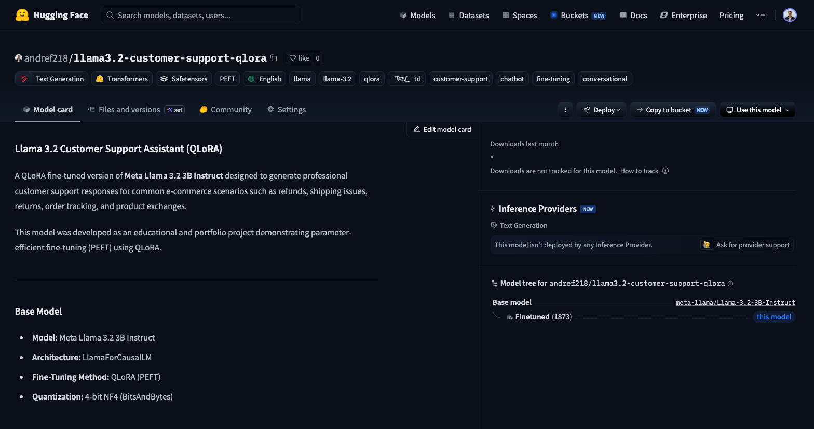
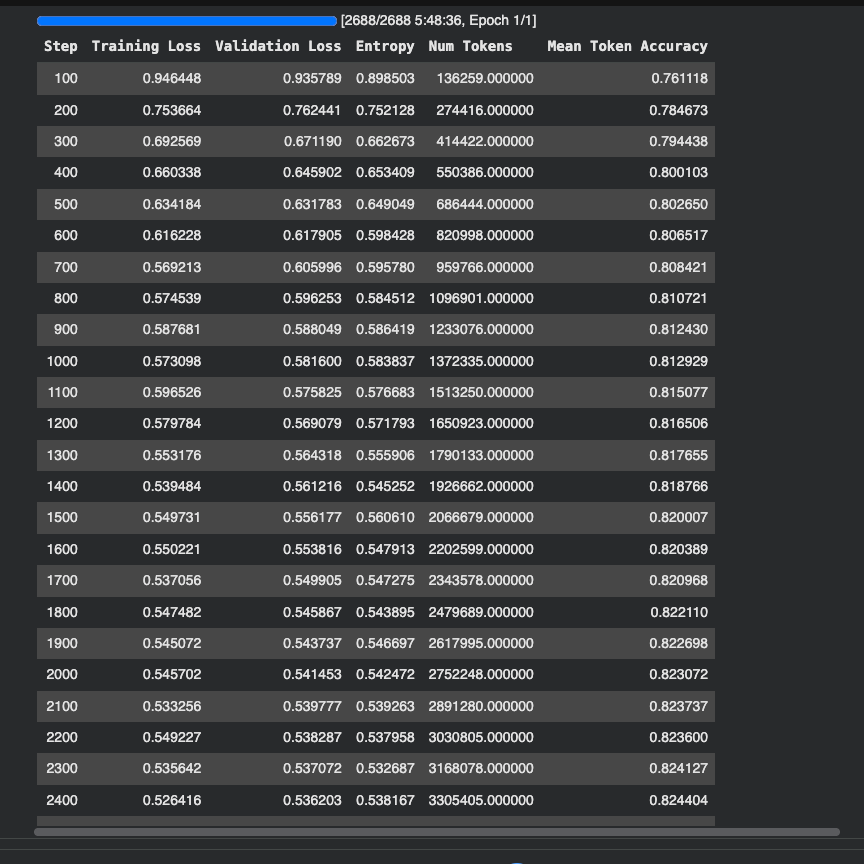
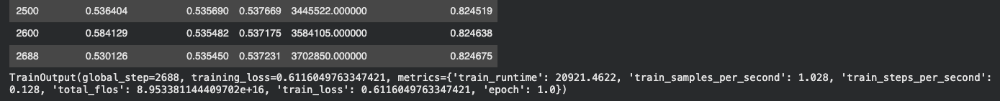
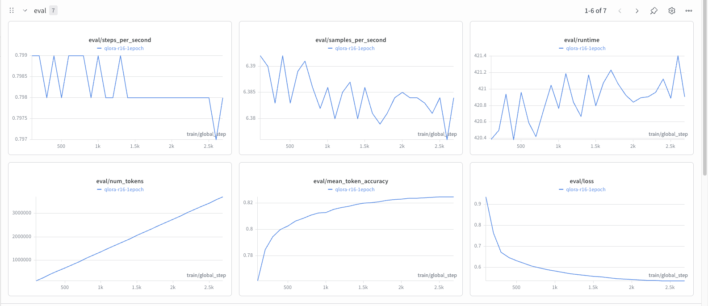
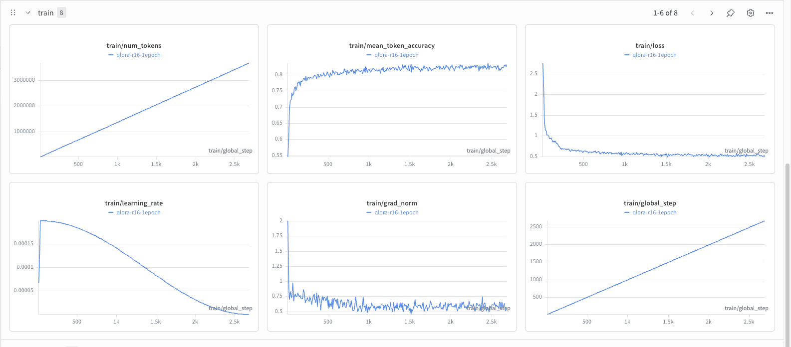

# Llama 3.2 Customer Support Fine-Tuning (QLoRA)

<div align="center">


[](https://huggingface.co/andref218/llama3.2-customer-support-qlora)

**Parameter-Efficient Fine-Tuning of Meta Llama 3.2 3B Instruct using QLoRA for Customer Support**

**Hugging Face Model**:

[andref218/llama3.2-customer-support-qlora](https://huggingface.co/andref218/llama3.2-customer-support-qlora)

[](https://huggingface.co/andref218/llama3.2-customer-support-qlora)

</div>

---

## Overview

This project demonstrates how to fine-tune **Meta's Llama 3.2 3B Instruct** using **QLoRA (Quantized Low-Rank Adaptation)** to build a specialized customer support assistant capable of handling common e-commerce support requests.

Instead of updating all **3.2 billion model parameters**, this project fine-tunes only **0.28%** of the parameters by combining **4-bit quantization** with **LoRA adapters**, dramatically reducing GPU memory usage while maintaining strong performance.

The model was trained on the **Bitext Customer Support Dataset**, covering thousands of real-world customer support conversations including refunds, returns, shipping issues, damaged products, account assistance, and order tracking.

This repository documents the complete fine-tuning workflow, from dataset preparation and model training to inference and publishing the trained LoRA adapter on the Hugging Face Hub.

# Features

- Fine-tuned **Meta Llama 3.2 3B Instruct** using **QLoRA** for customer support tasks.
- Efficient **4-bit quantization** with BitsAndBytes to reduce GPU memory requirements.
- Parameter-Efficient Fine-Tuning (PEFT) using **LoRA adapters**.
- Supervised Fine-Tuning (SFT) with the **Bitext Customer Support** dataset.
- Experiment tracking and visualization with **Weights & Biases**.
- Published trained LoRA adapter on the **Hugging Face Hub**.
- Fully documented **Google Colab notebook** reproducing the complete training workflow.
- Modular codebase with reusable dataset formatting utilities.

# Project Architecture

The complete training workflow is illustrated below.

```text
                   Bitext Customer Support Dataset
                                │
                                ▼
                 Dataset Formatting (Chat Template)
                                │
                                ▼
                Meta Llama 3.2 3B Instruct (Frozen)
                                │
                  4-bit Quantization (BitsAndBytes)
                                │
                                ▼
                      QLoRA (LoRA Adapters)
                                │
                                ▼
                Supervised Fine-Tuning (SFTTrainer)
                                │
                                ▼
                     Trained LoRA Adapters

```

## Fine-Tuning Pipeline

The project follows the standard QLoRA workflow:

1. Load the Bitext Customer Support dataset.
2. Format every conversation using the Meta Llama chat template.
3. Load the base Llama 3.2 3B Instruct model.
4. Quantize the model to 4-bit using BitsAndBytes.
5. Prepare the quantized model for parameter-efficient fine-tuning.
6. Attach LoRA adapters to the attention projection layers.
7. Fine-tune the adapters using Supervised Fine-Tuning (TRL).
8. Save the trained LoRA adapters locally.
9. Optionally publish the adapter to the Hugging Face Hub.

---

# Model Information

| Property           | Value                       |
| ------------------ | --------------------------- |
| Base Model         | Meta Llama 3.2 3B Instruct  |
| Model Type         | Causal Language Model (LLM) |
| Parameters         | ~3.22 Billion               |
| Fine-Tuning Method | QLoRA                       |
| Adapter Framework  | PEFT (LoRA)                 |
| Quantization       | 4-bit NF4                   |
| Training Library   | TRL (SFTTrainer)            |
| Primary Task       | Customer Support Assistant  |

## Why Llama 3.2?

Meta Llama 3.2 3B Instruct was selected because it provides an excellent balance between model capability and computational efficiency.

Compared to larger models, the 3B variant can be fine-tuned on accessible hardware while still demonstrating strong instruction-following capabilities.

This makes it an ideal choice for experimenting with Parameter-Efficient Fine-Tuning techniques such as QLoRA.

## Why QLoRA?

Traditional fine-tuning updates every parameter of a large language model, requiring significant computational resources.

QLoRA combines:

- **4-bit quantization** to dramatically reduce memory usage.
- **LoRA adapters** to train only a small subset of parameters.
- **Frozen base model weights**, preserving the original pretrained knowledge.

As a result, only **0.28%** of the model parameters are updated during training, making fine-tuning feasible on a single Google Colab GPU without sacrificing strong performance.

---

# Dataset

### Bitext Customer Support Dataset

This project uses the **Bitext Customer Support LLM Chatbot Training Dataset**, publicly available on the Hugging Face Hub.

🔗 https://huggingface.co/datasets/bitext/Bitext-customer-support-llm-chatbot-training-dataset

The dataset contains thousands of customer support conversations covering realistic e-commerce scenarios, making it well suited for instruction tuning customer service assistants.

### Example Topics

The dataset includes conversations related to:

- Order tracking
- Shipping delays
- Refund requests
- Product returns
- Product exchanges
- Order cancellations
- General customer support

## Dataset Split

The original dataset only provides a **training split**.

To enable proper model evaluation, the dataset was divided into three subsets:

| Split      | Percentage |
| ---------- | ---------: |
| Training   |        80% |
| Validation |        10% |
| Test       |        10% |

The validation set is used during training to monitor performance and select the best checkpoint based on validation loss.

The test set is reserved for evaluating the model on previously unseen conversations.

---

## Conversation Formatting

Before training, every conversation is converted into the **Meta Llama 3.2 chat template**.

Each training example follows the standard instruction-tuning format:

```text
<|user|>
Customer question...

<|assistant|>
Expected response...
```

Using the native chat template ensures that the model learns in the same conversational format expected during inference.

---

## Why This Dataset?

This dataset was selected because it:

- contains realistic customer support conversations;
- covers a broad range of common support scenarios;
- is well suited for demonstrating parameter-efficient fine-tuning techniques such as QLoRA.

---

# Training Pipeline

The fine-tuning workflow follows the standard **QLoRA training pipeline**, combining model quantization with parameter-efficient fine-tuning.

## Fine-Tuning Workflow

The complete pipeline consists of the following stages:

### 1. Dataset Loading

The Bitext Customer Support dataset is downloaded from the Hugging Face Hub.

### 2. Dataset Formatting

Each conversation is converted into the native **Meta Llama 3.2 chat template** before training.

This ensures the model learns the same conversational format used during inference.

### 3. Model Loading

The pretrained **Meta Llama 3.2 3B Instruct** model is loaded using the Hugging Face Transformers library.

### 4. 4-bit Quantization

The base model is quantized using **BitsAndBytes** with the **NF4** quantization scheme.

This significantly reduces GPU memory usage while maintaining model quality.

### 5. Model Preparation

The quantized model is prepared for parameter-efficient fine-tuning using the PEFT library.

### 6. LoRA Injection

LoRA adapters are attached to the attention projection layers:

- Query Projection (`q_proj`)
- Key Projection (`k_proj`)
- Value Projection (`v_proj`)
- Output Projection (`o_proj`)

Only these adapter weights are updated during training.

### 7. Supervised Fine-Tuning

The adapters are optimized using **TRL's SFTTrainer**, while the original model weights remain frozen.

### 8. Model Saving

After training, only the LoRA adapter weights are saved.

This keeps the final model lightweight and allows it to be merged with the original base model during inference.

### 9. Inference

The trained adapter can be loaded together with the original Llama 3.2 model to generate customer support responses for unseen prompts.

---

# Training Results

The model was fine-tuned using QLoRA for one epoch on the Bitext Customer Support dataset.

During training, both training and validation metrics were monitored to ensure stable convergence.

## Training Progress




The training loss steadily decreased throughout the fine-tuning process, while the validation loss followed a similar trend, indicating stable learning without significant signs of overfitting.

---

## Weights & Biases Metrics

Training metrics were also tracked using Weights & Biases.

### Evaluation Metrics



### Training Metrics



---

# Inference Examples

After fine-tuning, the LoRA adapters can be loaded together with the original **Meta Llama 3.2 3B Instruct** model to answer previously unseen customer support requests.

The examples below were generated using the helper function implemented in `train.py`.

---

## Example 1

**User**

```text
I want to return my product.
```

**Assistant**

```text
I'm sorry to hear that the product didn't meet your expectations.

To start a return, please provide your order number. Once verified, I'll guide you through the return process and explain the available refund or exchange options.
```

---

## Example 2

**User**

```text
My package hasn't arrived.
```

**Assistant**

```text
I'm sorry to hear that your package hasn't arrived.

Could you please provide your order number or tracking number? I'll check the shipping status and help determine the next steps.
```

---

## Example 3

**User**

```text
How do I request a refund?
```

**Assistant**

```text
To request a refund, please provide your order number and briefly describe the reason for the request.

Once your order has been verified, I can explain the refund process and estimated processing time.
```

---

# Hugging Face Model

The trained LoRA adapter has been published on the Hugging Face Hub and can be downloaded directly.

🔗 https://huggingface.co/andref218/llama3.2-customer-support-qlora

---

## Loading the Adapter

The LoRA adapter can be loaded on top of the original **Meta Llama 3.2 3B Instruct** model using the PEFT library.

```python
from transformers import AutoModelForCausalLM, AutoTokenizer
from peft import PeftModel

BASE_MODEL = "meta-llama/Llama-3.2-3B-Instruct"

tokenizer = AutoTokenizer.from_pretrained(BASE_MODEL)

base_model = AutoModelForCausalLM.from_pretrained(
    BASE_MODEL,
    device_map="auto",
)

model = PeftModel.from_pretrained(
    base_model,
    "andref218/llama3.2-customer-support-qlora",
)
```

---

## Why Publish the Adapter?

Publishing only the **LoRA adapter** instead of the full model offers several advantages:

- significantly smaller download size;
- faster distribution;
- lower storage requirements;
- easy integration with the original pretrained model;

This approach follows the standard workflow adopted by the Hugging Face community for parameter-efficient fine-tuning projects.

---

# Installation

## Clone the Repository

```bash
git clone https://github.com/andref218/llama3.2-customer-support-qlora.git

cd llama3.2-customer-support-qlora
```

---

## Install Dependencies

This project uses **uv** for dependency management.

```bash
uv sync
```

If you don't have **uv** installed:

```bash
pip install uv
```

---

## Environment Variables

Create a `.env` file in the project root.

```text
HF_TOKEN=your_huggingface_token
WANDB_API_KEY=your_wandb_api_key
```

### Required Accounts

The project requires:

- Hugging Face account 🤗 
- Weights & Biases account 📊 

---

## Run Fine-Tuning

```bash
python train.py
```

The script will:

1. Authenticate with Hugging Face.
2. Authenticate with Weights & Biases.
3. Download the Bitext Customer Support dataset.
4. Load Meta Llama 3.2 3B Instruct.
5. Quantize the model to 4-bit.
6. Attach LoRA adapters.
7. Fine-tune the model.
8. Save the trained adapters locally.

---

## Output

After training, the LoRA adapters are saved inside:

```text
outputs/
└── final_model/
```

This directory contains:

- LoRA adapter weights
- tokenizer files
- configuration files

The base model itself is **not** stored, since only the adapters are trained.

---

## Google Colab Notebook

For users without access to a local GPU, the complete training workflow is also available as a Google Colab notebook inside the `notebooks/` directory.

The notebook reproduces the same fine-tuning pipeline while taking advantage of Colab GPU resources.

---

# What I Learned

Through this project, I gained practical experience with several key concepts in modern LLM engineering.

## Large Language Models

- Loading and working with Meta Llama 3.2 Instruct models.
- Using chat templates for conversational fine-tuning.

---

## Parameter-Efficient Fine-Tuning (PEFT)

- Applying LoRA adapters instead of updating the full model.
- Understanding why LoRA dramatically reduces the number of trainable parameters.
- Using the PEFT library to build efficient fine-tuning pipelines.

---

## QLoRA

- Fine-tuning quantized language models.
- Using 4-bit NF4 quantization with BitsAndBytes.
- Reducing GPU memory requirements while maintaining model performance.

---

## Hugging Face Ecosystem

- Loading pretrained models.
- Working with Hugging Face Datasets.
- Publishing trained LoRA adapters to the Hugging Face Hub.

---

## TRL

- Using the SFTTrainer for supervised fine-tuning.
- Configuring training arguments.
- Monitoring validation performance during training.

---

## Experiment Tracking

- Logging experiments using Weights & Biases.
- Monitoring training and validation loss.
- Comparing training runs.

---

## Software Engineering

Beyond machine learning, this project also reinforced software engineering best practices, including:

- Modular project organization.
- Dependency management using `uv`.
- Git version control with incremental commits.
- Clear project documentation.

# Author

**André Fonseca**

- GitHub: https://github.com/andref218
- Hugging Face: https://huggingface.co/andref218

# License

This project is licensed under the MIT License. See the [LICENSE](LICENSE) file for more information.
